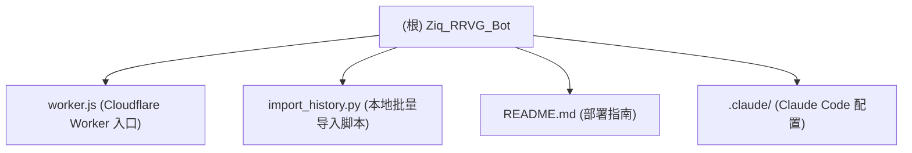

# Ziq_RRVG_Bot - 项目文档

> 变更记录见文末 Changelog 节。

---

## 项目愿景

籽青 (Ziq) 是一个专为 Telegram 超级群组 (Supergroup) 及其话题 (Topics) 功能打造的媒体收集与分发机器人。基于 **Cloudflare Workers + D1 数据库**构建，完全 Serverless，零服务器成本。核心定位：让群组图库的管理与分发做到自动化、私密、可配置。

---

## 架构总览

```
Telegram Bot API  <-->  Cloudflare Worker (worker.js)  <-->  Cloudflare D1 (SQLite)
                              |
                   /           /webhook        /api/import
               (部署初始化)   (消息路由)        (外部批量导入)
```

- **运行时**：Cloudflare Workers (ES Module 格式，`export default { fetch }`)
- **数据库**：Cloudflare D1（绑定名必须为 `D1`），内含 7 张表
- **语言**：JavaScript (单文件 `worker.js`) + Python 3 工具脚本 (`import_history.py`)
- **Webhook 机制**：自托管 Webhook，部署时访问 `GET /` 自动注册

---

## 模块结构图



> 本项目为单模块结构，所有核心逻辑集中于 `worker.js`，Python 脚本为独立运维工具。

---

## 模块索引

| 路径 | 职责 | 语言 | 状态 |
|---|---|---|---|
| `worker.js` | Cloudflare Worker 主入口，包含全部 Bot 逻辑 | JavaScript | 生产 |
| `import_history.py` | 本地 Python 脚本，分批向 Worker API 导入大型历史数据 | Python 3 | 工具 |
| `.claude/settings.local.json` | Claude Code 本地权限配置 | JSON | 配置 |

---

## 运行与开发

### 必要环境变量（Cloudflare Worker Secrets / Variables）

| 变量名 | 是否必填 | 说明 |
|---|---|---|
| `BOT_TOKEN_ENV` | 必填 | Telegram BotFather 颁发的 Bot Token |
| `ADMIN_SECRET` | 可选 | 外部导入 API (`/api/import`) 的鉴权密钥 |

### D1 数据库绑定

在 Cloudflare Worker 的 Integrations 中创建 D1 数据库，绑定变量名必须为 `D1`。首次访问 `GET /` 会自动建表，无需手动执行 SQL。

### 一键部署流程

1. 在 Cloudflare 创建 Worker，上传 `worker.js` 代码
2. 创建 D1 数据库，在 Worker Integrations 中绑定（变量名 `D1`）
3. 添加环境变量 `BOT_TOKEN_ENV`（以及可选的 `ADMIN_SECRET`）
4. 在浏览器访问 Worker 域名（`GET /`），看到"部署大成功"页面即完成
5. Telegram 端：将 Bot 邀请至目标群组并授予管理员权限

### 本地大数据导入（Python 脚本）

```bash
pip install requests
# 编辑 import_history.py 填写 WORKER_URL / ADMIN_SECRET / JSON_FILE_PATH / TARGET_CHAT_ID / TARGET_CATEGORY
python import_history.py
```

### 机器人命令

| 命令 | 权限 | 说明 |
|---|---|---|
| `/start` | 所有成员 | 呼出主控制面板 |
| `/help` | 所有成员 | 查看帮助 |
| `/bind <分类名>` | 管理员 | 将当前话题绑定为采集库 |
| `/bind_output` | 管理员 | 将当前话题设为输出展示窗口 |
| `/import_json` | 所有成员 | 查看历史导入帮助说明 |
| 发送 `.json` 文件 + caption `/import <分类名>` | 管理员 | 内置直导（≤5MB） |

---

## 数据库结构（D1）

| 表名 | 主键 | 说明 |
|---|---|---|
| `config_topics` | `id` AUTOINCREMENT | 话题与分类的绑定配置，含 `chat_id`、`topic_id`、`category_name` |
| `media_library` | `id` AUTOINCREMENT | 媒体记录库，含 `file_unique_id`、`file_id`、`media_type`、`view_count` |
| `user_favorites` | `(user_id, media_id)` | 用户收藏夹，多对多关联 |
| `last_served` | `user_id` | 记录每个用户最近一次抽取的媒体，用于连点防刷 |
| `served_history` | `media_id` | 防重库，记录已推送过的媒体 ID |
| `chat_settings` | `(chat_id, key)` | V5.5 核心：每个群组独立的设置键值对 |
| `bot_settings` | `key` | 旧版全局设置表（兼容保留，新逻辑不再使用） |

---

## 测试策略

当前版本无自动化测试框架。测试方式为：

- **手动集成测试**：部署至 Cloudflare Worker 后，在 Telegram 群组内直接触发各命令
- **部署验证**：访问 `GET /` 检查自动建表与 Webhook 注册是否成功
- **数据导入验证**：使用 `import_history.py` 脚本向 `/api/import` 发送测试数据，确认入库

> 建议：未来可引入 `jest`/`vitest` + Miniflare 对 Cloudflare Worker 进行单元测试。

---

## 编码规范

- **语言**：标准 ES2022+ JavaScript，Cloudflare Workers 环境（无 Node.js API）
- **格式**：单文件结构，各功能块用注释分隔（`/* === 区块名 === */`）
- **版本标记**：在注释和 UI 文案中以 `V5.5` 等标记版本
- **异步**：全量使用 `async/await`
- **错误处理**：Worker 顶层使用 `try/catch` 捕获异常，返回 500；D1 操作异常在函数内局部处理
- **注意**：所有代码由 AI（Google Gemini Pro）辅助生成，项目 99% 由 AI 编写

---

## API 端点

| 方法 | 路径 | 鉴权 | 说明 |
|---|---|---|---|
| `GET` | `/` | 无 | 部署初始化：建表 + 注册 Webhook，返回 HTML 成功页 |
| `POST` | `/webhook` | Telegram 回调 | 接收 Telegram Update，路由消息与回调 |
| `POST` | `/api/import` | `Authorization: ADMIN_SECRET`（可选） | 外部批量导入媒体记录 |

---

## AI 使用指引

- 本项目逻辑全集中于 `worker.js` 单文件，阅读时重点关注以下函数入口：
  - `handleMessage` - 文本命令与媒体收录
  - `handleCallback` - 所有 InlineKeyboard 按钮交互
  - `sendRandomMedia` - 随机抽取核心逻辑（含探活与自动清理）
  - `getSetting` / `toggleSetting` - 群组独立设置读写
- 修改时注意 D1 查询使用 `?` 占位符，禁止字符串拼接 SQL
- Cloudflare Workers 没有 `setTimeout`/`setInterval`；异步调度通过 `ctx.waitUntil` 实现
- `tgAPI` 函数返回原始 `Response` 对象，需手动 `.json()` 解析
- `env.BOT_TOKEN_ENV` 在所有 Telegram API 调用中不可缺少

---

## 变更记录 (Changelog)

| 时间 | 描述 |
|---|---|
| 2026-02-21 16:24:53 | 初次扫描生成 CLAUDE.md，覆盖率 100%（3 个核心文件全量扫描） |
